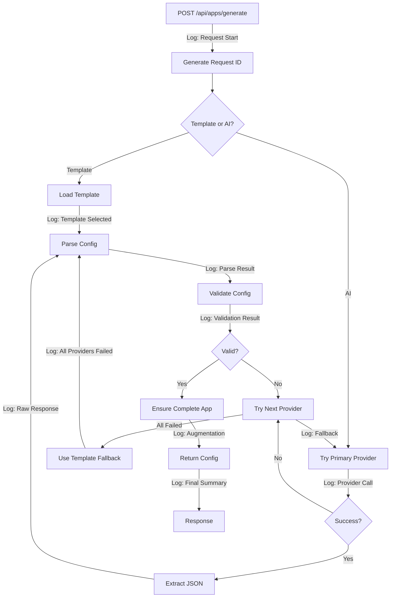

# Design Document: AI Generation Reliability Fix

## Overview

This design addresses reliability issues in the AI App Generator where the system generates incomplete applications (hero-only pages) instead of complete CRUD applications. The core problem is lack of visibility into the generation pipeline - we cannot verify:

1. Whether code changes are executing (potential caching issues)
2. Which AI provider is being called and what it returns
3. Whether validation logic correctly rejects incomplete configs
4. Whether `ensureCompleteApp()` properly augments missing pages

The solution adds comprehensive structured logging throughout the generation pipeline, enhances validation enforcement, improves prompt engineering, and adds testing infrastructure. This is primarily a **debugging and observability enhancement** rather than a new feature.

**Key Design Decisions:**
- Structured logging with correlation IDs for request tracing
- Validation enforcement at multiple pipeline stages
- Multi-level logging (trace execution, validate inputs, track transformations)
- No database schema changes required
- Backward compatible with existing API contracts

## Architecture

### System Components

The AI generation pipeline consists of these components:

```
User Request → API Route → AI Provider Chain → Config Parsing → Validation → Augmentation → Response
```

**Component Responsibilities:**

1. **API Route** (`/api/apps/generate/route.ts`): Entry point, session validation, request orchestration
2. **AI Provider Chain** (`lib/mistral.ts`): Multi-provider fallback (Groq → Mistral → OpenAI → Anthropic → Templates)
3. **Config Parser** (`lib/config/parser.ts`): JSON parsing, schema normalization, field validation
4. **Config Validator**: Validates complete app structure (entities, table pages, form pages)
5. **Config Augmenter** (`ensureCompleteApp`): Adds missing CRUD pages, theme colors, stats
6. **Template Fallback** (`lib/config/templates.ts`): Curated app configs when AI fails

### Logging Architecture


**Structured Logging Design:**

```typescript
interface LogEntry {
  timestamp: string;
  requestId: string;
  component: 'api' | 'provider' | 'parser' | 'validator' | 'augmenter';
  level: 'info' | 'warn' | 'error' | 'debug';
  event: string;
  data?: Record<string, unknown>;
}
```

**Logging Levels:**
- `debug`: Detailed execution traces (function entry/exit, intermediate states)
- `info`: Normal operations (provider calls, validation results, augmentation summaries)
- `warn`: Recoverable issues (provider fallbacks, config rejections, template usage)
- `error`: Failures (API errors, parsing failures, validation errors)

**Request Correlation:**
Each generation request gets a unique ID (UUID) that appears in all log entries, enabling full request tracing.

### Data Flow with Logging Points



## Components and Interfaces

### 1. Logger Interface

**Purpose:** Centralized structured logging with request correlation

```typescript
// lib/logger.ts
interface Logger {
  debug(component: string, event: string, data?: Record<string, unknown>): void;
  info(component: string, event: string, data?: Record<string, unknown>): void;
  warn(component: string, event: string, data?: Record<string, unknown>): void;
  error(component: string, event: string, error: unknown, data?: Record<string, unknown>): void;
}

function createLogger(requestId: string): Logger;
function generateRequestId(): string; // UUID v4
```

**Implementation Notes:**
- Uses `console.log` with structured JSON for Next.js dev server visibility
- Includes timestamp, requestId, component, level, event, data
- Error objects serialized with message, stack, and custom properties

### 2. Enhanced API Route

**File:** `app/api/apps/generate/route.ts`

**Changes:**
- Generate request ID at entry
- Log request start with prompt and template info
- Log environment details on startup (cache-busting version)
- Log final config summary before return
- Log total execution time

**New Exports:**
- `GET /api/apps/generate/health` - Health check endpoint returning version and provider status

### 3. AI Provider Chain with Tracing

**File:** `lib/mistral.ts`

**Enhanced Functions:**

```typescript
async function tryProvider(
  provider: Provider,
  prompt: string,
  logger: Logger
): Promise<AppConfig | null> {
  // Log: provider attempt start
  // Log: API key status (present/missing, first 4 chars for verification)
  // Log: model being used
  // Call provider API
  // Log: HTTP response status
  // Log: response time
  // Log: raw response structure (entity count, page count, page kinds)
  // Validate with isUsableConfig
  // Log: validation result (pass/fail with reason)
  // Return result or null
}

async function generateConfigFromPrompt(
  prompt: string,
  logger: Logger
): Promise<AppConfig> {
  // Log: generation start
  // Log: provider chain order
  // Try each provider with logging
  // Log: fallback to template if all fail
  // Log: final config summary
  // Return config
}

function isUsableConfig(cfg: AppConfig, logger: Logger): boolean {
  // Log: validation start
  // Log: entity count
  // Log: presence of table pages (count, which entities)
  // Log: presence of form pages (count, which entities)
  // Log: validation decision (pass/fail with reason)
  // Return boolean
}
```

**Prompt Engineering Enhancement:**
- System prompt includes explicit warnings about hero-only apps
- User prompt reinforces requirement for table and form pages per entity
- Response format instruction emphasizes complete CRUD structure

### 4. Config Parser with Tracing

**File:** `lib/config/parser.ts`

**Enhanced Functions:**

```typescript
function parseConfig(input: unknown, logger?: Logger): AppConfig {
  // Log: parse start (input type, size if string)
  // Attempt JSON parse if string
  // Log: JSON parse result (success/fail)
  // Validate and normalize fields
  // Log: corrections applied (missing fields filled, invalid values coerced)
  // Log: final structure (entity count, page count)
  // Return AppConfig
}

function ensureCompleteApp(cfg: AppConfig, logger?: Logger): AppConfig {
  // Log: augmentation start
  // Log: input state (entities, pages, existing routes)
  // Check for home page, add if missing
  // Log: home page status (exists/added)
  // Check for stats page, add if missing
  // Log: stats page status (exists/added)
  // For each entity:
  //   Log: entity processing (name, existing pages)
  //   Check for table page, add if missing
  //   Log: table page status (exists/added with route)
  //   Check for form page, add if missing
  //   Log: form page status (exists/added with route)
  // Generate theme colors if missing
  // Log: theme status (AI-provided/generated, colors)
  // Log: augmentation summary (pages added, final page count)
  // Return augmented AppConfig
}
```

### 5. Health Check Endpoint

**Route:** `GET /api/apps/generate/health`

**Response:**
```typescript
interface HealthResponse {
  status: 'ok';
  version: string; // Git commit hash or package.json version
  timestamp: string;
  providers: {
    primary: string;
    configured: string[]; // Providers with API keys present
  };
  cache: {
    nodeVersion: string;
    processUptime: number;
  };
}
```

**Purpose:** Verify which code version is running, which providers are configured, and process uptime (helps identify if restart is needed).

## Data Models

No new database models required. All changes are logging and validation enhancements.

**Configuration Structures (existing):**

```typescript
interface AppConfig {
  name: string;
  description: string;
  theme?: {
    primary?: string;
    accent?: string;
    logoText?: string;
    faviconEmoji?: string;
  };
  entities: EntityDef[];
  pages: PageDef[];
  workflows?: unknown;
  i18n?: Record<string, Record<string, string>>;
}

interface EntityDef {
  name: string;
  label: string;
  labelPlural: string;
  fields: FieldDef[];
  defaultPage?: string;
}

interface PageDef {
  id: string;
  route: string;
  title: string;
  entity?: string;
  layout?: 'default' | 'full' | 'sidebar';
  root: ComponentNode;
}

interface ComponentNode {
  id?: string;
  kind: 'hero' | 'heading' | 'text' | 'stats' | 'table' | 'form' | 'chart' | 'card' | 'button' | 'list' | 'iframe' | 'divider' | 'spacer';
  props: Record<string, unknown>;
  children?: ComponentNode[];
}
```

**Validation Criteria:**

A config is "usable" (complete CRUD app) if:
1. At least one entity exists
2. At least one page with `root.kind === 'table'` exists
3. At least one page with `root.kind === 'form'` exists

**Augmentation Rules:**

`ensureCompleteApp` adds:
1. Home page on `/` with hero if missing
2. Stats page on `/` with entity counts if no stats exist
3. For each entity:
   - Table page on `/{entity-plural}` if missing
   - Form page on `/{entity-plural}/new` if missing
4. Theme colors (deterministic hash of app name) if not provided

## Error Handling

### Provider Failure Handling

**Scenario:** AI provider call fails (HTTP error, timeout, invalid response)

**Response:**
1. Log error with provider name, HTTP status, error message
2. Log fallback to next provider in chain
3. Try next provider
4. If all providers fail, log template fallback decision
5. Return template config with logging

**No user-facing errors for provider failures** - system degrades gracefully to templates.

### Parsing Failure Handling

**Scenario:** AI returns non-JSON or malformed JSON

**Response:**
1. Log parsing failure with input snippet (first 200 chars)
2. Attempt markdown fence stripping and retry
3. Attempt regex extraction of first `{...}` block
4. If all parsing attempts fail, return null
5. Provider chain continues to next provider

### Validation Failure Handling

**Scenario:** Parsed config lacks entities, table pages, or form pages


**Response:**
1. Log validation failure with specific missing components
2. Reject config (return null from `tryProvider`)
3. Continue to next provider in chain
4. Template fallback if all providers produce invalid configs

**Key Insight:** `ensureCompleteApp` should be the **last line of defense**, not the primary mechanism. AI providers should be rejected if they return incomplete configs, forcing fallback to better providers or templates.

### Cache/Build Staleness

**Scenario:** Code changes not reflected in dev server

**Detection:**
1. Health check endpoint returns version identifier
2. Startup logs include timestamp and process info
3. Each log entry includes Node.js version

**Resolution (documented):**
1. Stop dev server (`Ctrl+C`)
2. Clear Next.js cache: `rm -rf .next`
3. Restart dev server: `npm run dev`
4. Verify health endpoint shows new version
5. Check startup logs show current timestamp

## Testing Strategy

**Note on Property-Based Testing:** This design does not include a Correctness Properties section because property-based testing (PBT) is not appropriate for this feature. The work primarily involves:

1. **Logging infrastructure** - Side-effect operations (writing to console) that don't have testable return values
2. **External API calls** - Non-deterministic behavior (AI responses vary), expensive to run 100+ times
3. **Integration testing** - Testing interactions with external services (Groq, Mistral, OpenAI, Anthropic)
4. **Configuration validation** - Depends on external AI responses, not pure input/output functions

PBT is designed for pure functions with universal properties that should hold across all inputs. This feature is about observability, tracing, and integration - areas where example-based unit tests and integration tests are more appropriate.

**Testing Approach:**

### 1. Unit Tests (Example-Based)

**Config Parser Tests:**
- Valid JSON string → parsed AppConfig
- Invalid JSON → safe empty config
- Missing fields → filled with defaults
- Invalid field types → coerced to valid values
- Hero-only config → entities/pages preserved

**Config Validator Tests:**
- Config with entities, table, form → `isUsableConfig` returns true
- Config with entities but no table → returns false
- Config with entities but no form → returns false
- Empty entities → returns false

**Augmentation Tests:**
- Empty pages → adds home, stats, table, form for each entity
- Missing table for entity → adds table page
- Missing form for entity → adds form page
- Missing theme → generates deterministic colors
- Complete config → no changes (idempotent)

**Logger Tests:**
- Log entry includes all required fields (timestamp, requestId, component, level, event)
- Request ID generation produces unique values
- Error serialization captures message and stack

### 2. Integration Tests

**API Route Tests:**
- POST with template ID → returns complete config from template
- POST with AI prompt (mocked provider) → returns augmented config
- POST with no auth → 401 error
- POST with invalid JSON → 400 error
- Health check endpoint → returns version and provider info

**Provider Chain Tests (Mocked):**
- Primary provider succeeds → uses primary, logs success
- Primary fails, secondary succeeds → logs fallback, uses secondary
- All providers fail → logs template fallback, uses template
- Provider returns incomplete config → logs rejection, tries next provider

**End-to-End Flow Tests:**
- Generate request → logs show: request start, provider call, validation, augmentation, final summary
- Failed provider → logs show: error, fallback decision
- Template usage → logs show: template selection reason

### 3. Manual Testing

**Test Prompts:**
1. "Build a CRM app" → should match CRM template or generate contacts/deals entities
2. "Build a habit tracker" → should match habit tracker template
3. "Build a task manager" → should match tasks template
4. "Build a book library" → should generate book entity with table and form pages

**Verification:**
- Check logs for complete request trace
- Verify final config has entities, table pages, form pages
- Verify theme colors are present
- Verify no hero-only configs

### 4. Test Mode Support

**Environment Variable:** `AI_TEST_MODE=true`

**Behavior:**
- Skip external API calls
- Use template fallback immediately
- Log all intermediate results
- Include detailed config structure in logs

**Purpose:** Verify pipeline without consuming AI API credits or depending on external services.

## Implementation Notes

### Code Organization


**New Files:**
- `lib/logger.ts` - Structured logging utilities
- `lib/version.ts` - Version identification (Git hash or package.json version)
- `app/api/apps/generate/health/route.ts` - Health check endpoint

**Modified Files:**
- `app/api/apps/generate/route.ts` - Add logging, request correlation
- `lib/mistral.ts` - Add provider tracing, enhanced validation, improved prompts
- `lib/config/parser.ts` - Add logging to parseConfig and ensureCompleteApp

### Logging Best Practices

**What to Log:**
- Entry/exit of major functions (with timing)
- Decision points (validation pass/fail, provider selection)
- Transformations (config before/after augmentation)
- Errors with full context (provider name, HTTP status, error message)

**What NOT to Log:**
- User session tokens or API keys (security)
- Full AI responses (noise, may be large)
- Sensitive user data (prompts are okay, but not user PII if added later)

**Log Volume Management:**
- Use `debug` level for detailed traces (can be filtered)
- Use `info` for normal operations
- Use `warn` for issues that don't break the flow
- Use `error` for failures

### Prompt Engineering Principles

**System Prompt Requirements:**
1. Explicitly list allowed component kinds
2. Warn against hero-only apps (multiple times)
3. Provide complete example with all page types
4. State "HARD RULES" section with numbered requirements
5. Emphasize entity-page relationship (table + form per entity)

**User Prompt Requirements:**
1. Restate user's request
2. Remind AI to include table and form pages for EVERY entity
3. Request JSON-only output

**Response Format:**
- Request `response_format: { type: 'json_object' }` where supported (Groq, Mistral, OpenAI)
- Handle markdown fences in response parsing (Anthropic)

### Caching and Version Management

**Version Identifier:**
Use one of:
1. Git commit hash (if `.git` exists): `git rev-parse --short HEAD`
2. Package.json version + timestamp: `${version}-${Date.now()}`
3. Environment variable: `process.env.APP_VERSION`

**Cache Invalidation:**
Next.js caches:
- `.next/` directory (build artifacts)
- Module resolution cache (Node.js)

**Best Practice:**
- Restart dev server after code changes
- Clear `.next/` if changes not reflected
- Health endpoint verifies running version


## Requirements Traceability

### Requirement 1: Code Execution Verification

**Design Components:**
- Logger utility with request correlation (Logging Architecture)
- API route logs execution environment and request ID (Enhanced API Route)
- ensureCompleteApp logs entry/exit with counts (Config Parser with Tracing)
- Startup logging with version identifier (Version Management)

**Implementation:**
- Generate request ID at API entry
- Log environment details on first request
- Log function entry/exit with entity/page counts
- Include version in health check

### Requirement 2: AI Provider Execution Tracing

**Design Components:**
- Enhanced tryProvider function with detailed logging (AI Provider Chain)
- Provider chain logging in generateConfigFromPrompt (AI Provider Chain)
- Template fallback logging (Provider Failure Handling)

**Implementation:**
- Log provider name, model, API key status before call
- Log HTTP response status and timing
- Log response structure summary
- Log fallback transitions with reasons
- Log template selection when all providers fail

### Requirement 3: Configuration Validation Tracing

**Design Components:**
- Enhanced parseConfig with input/output logging (Config Parser with Tracing)
- Enhanced isUsableConfig with detailed decision logging (AI Provider Chain)
- Enhanced ensureCompleteApp with augmentation logging (Config Parser with Tracing)

**Implementation:**
- Log parseConfig input type and size
- Log parsing result with corrections
- Log isUsableConfig evaluation criteria and decision
- Log rejection reasons
- Log each page addition during augmentation

### Requirement 4: Complete App Generation Enforcement

**Design Components:**
- Validation in isUsableConfig (Data Models - Validation Criteria)
- Provider rejection for incomplete configs (Provider Failure Handling)
- Comprehensive augmentation in ensureCompleteApp (Data Models - Augmentation Rules)

**Implementation:**
- Validate entity count > 0
- Validate presence of table pages
- Validate presence of form pages
- Reject configs failing validation (return null)
- Add missing home, stats, table, form pages
- Log validation failures with specific reasons


### Requirement 5: Prompt Engineering Verification

**Design Components:**
- Enhanced system prompt with explicit rules (Prompt Engineering Principles)
- Enhanced user prompt with CRUD reminders (Prompt Engineering Principles)
- Logging of prompts sent to providers (AI Provider Chain)

**Implementation:**
- Log full system prompt before provider call
- Log user prompt with app generation instructions
- System prompt explicitly requires table pages per entity
- System prompt explicitly requires form pages per entity
- System prompt warns against hero-only apps
- User prompt reinforces requirements

### Requirement 6: Theme Color Application Verification

**Design Components:**
- Theme generation in ensureCompleteApp (Data Models - Augmentation Rules)
- Theme logging (Config Parser with Tracing)

**Implementation:**
- Generate colors from app name hash if missing
- Log color generation (AI-provided vs generated)
- Log selected primary and accent colors
- Preserve AI-provided colors when present
- Use deterministic palette selection

### Requirement 7: End-to-End Flow Validation

**Design Components:**
- Request correlation with unique IDs (Logging Architecture)
- Logging at all pipeline stages (Data Flow with Logging Points)
- Execution timing (Implementation Notes)

**Implementation:**
- Log request start with ID and prompt
- Log each provider attempt in sequence
- Log config parsing results
- Log validation pass/fail
- Log augmentation before/after
- Log final config summary
- Log total execution time and success status

### Requirement 8: Dev Server Cache Management

**Design Components:**
- Version identification system (Version Management)
- Health check endpoint (Health Check Endpoint)
- Startup logging (Implementation Notes)
- Documentation (Error Handling - Cache/Build Staleness)

**Implementation:**
- Document restart procedure in README
- Document cache clearing steps
- Log startup timestamp and version
- Health endpoint returns version and uptime
- Include Node.js version in logs


### Requirement 9: Integration Testing Support

**Design Components:**
- Test mode environment variable (Testing Strategy - Test Mode Support)
- Example test prompts (Testing Strategy - Manual Testing)
- Template validation (Testing Strategy - Unit Tests)

**Implementation:**
- AI_TEST_MODE env var to skip external calls
- Test mode uses template fallback with full logging
- Provide example prompts for known good configs
- Validate all templates pass isUsableConfig
- Log intermediate results in test mode

## Migration and Deployment

### Deployment Steps

1. **Add Logger Utility:**
   - Create `lib/logger.ts` with structured logging functions
   - Create `lib/version.ts` with version identification

2. **Update API Route:**
   - Add request ID generation
   - Add logging throughout handler
   - Create health check endpoint

3. **Update Provider Chain:**
   - Add logger parameter to all functions
   - Add detailed logging at each stage
   - Enhance prompts with explicit instructions

4. **Update Parser:**
   - Add optional logger parameter
   - Add logging to parseConfig
   - Add logging to ensureCompleteApp

5. **Test and Verify:**
   - Restart dev server
   - Clear `.next/` cache
   - Test with sample prompts
   - Verify logs appear in console
   - Check health endpoint

### Backward Compatibility

All changes are backward compatible:
- Optional logger parameters (existing calls work without logger)
- No API contract changes (request/response unchanged)
- No database schema changes
- Logging is additive (no breaking changes)

### Rollback Plan

If issues arise:
1. Revert to previous Git commit
2. Clear `.next/` cache
3. Restart dev server

No data migration required, so rollback is safe.


## Security Considerations

### Logging Security

**What to Exclude from Logs:**
- User API keys (GROQ_API_KEY, OPENAI_API_KEY, etc.) - only log first 4 chars or presence
- User session tokens
- Database connection strings
- Any PII (user emails, names) if added in future

**What's Safe to Log:**
- User prompts (already client-visible)
- Generated configs (public data)
- Provider names and models
- HTTP status codes
- Error messages (sanitize if they contain keys)

**Log Sanitization:**
```typescript
function sanitizeApiKey(key: string): string {
  return key.slice(0, 4) + '...' + key.slice(-4);
}

function sanitizeError(error: unknown): string {
  const message = error instanceof Error ? error.message : String(error);
  // Remove any strings that look like API keys
  return message.replace(/[a-zA-Z0-9_-]{32,}/g, '[REDACTED]');
}
```

### Rate Limiting

No changes to rate limiting - existing session-based authentication provides basic protection.

**Future Consideration:** Add per-user rate limiting if abuse is detected in logs.

## Performance Considerations

### Logging Overhead

**Impact:** Minimal
- Structured logging uses `console.log` (async in Node.js)
- No file I/O (logs go to stdout, Docker/systemd handles persistence)
- Estimated overhead: <5ms per request

**Optimization:**
- Use debug level for verbose logs (can be filtered by environment)
- Avoid logging large objects (log summaries instead)

### Validation Overhead

**Impact:** Negligible
- Config validation is in-memory object traversal
- O(n) where n = page count (typically 5-10 pages)
- Estimated overhead: <1ms per config

### Provider Call Performance

**No Change:** Logging doesn't affect external API call latency

**Timing Data:**
- Groq: ~500-2000ms
- OpenAI: ~1000-3000ms
- Anthropic: ~1000-4000ms
- Mistral: ~1000-3000ms

Logging helps identify slow providers for optimization.


## Open Questions and Future Enhancements

### Open Questions

1. **Log Persistence:** Should logs be persisted to a file or database for historical analysis?
   - Current: Logs go to stdout (Next.js dev server console)
   - Future: Consider log aggregation service (DataDog, LogRocket, CloudWatch)

2. **Alert Thresholds:** What percentage of template fallbacks should trigger alerts?
   - Suggestion: Alert if >50% of requests use template fallback (indicates provider issues)

3. **Config Quality Metrics:** Should we track config quality beyond "has entities/pages"?
   - Examples: Entity field count, page diversity, theme customization level

### Future Enhancements

**Phase 2 - Metrics and Analytics:**
- Provider success rates over time
- Average generation latency per provider
- Template fallback frequency by keyword
- Config quality scoring (beyond binary validation)

**Phase 3 - Smart Provider Selection:**
- Track which providers perform best for which prompt types
- Automatic provider reordering based on historical success
- Cost optimization (prefer free/cheap providers for simple prompts)

**Phase 4 - Config Improvement:**
- Iterative refinement (if config is incomplete, ask AI to fix it)
- Multi-turn generation (generate entities first, then pages)
- User feedback loop (learn from apps user keeps vs discards)

**Phase 5 - Advanced Validation:**
- Page route uniqueness checking
- Entity field name validation (no reserved words)
- Circular relation detection
- Component prop validation

## Success Metrics

### Immediate (Post-Implementation)

1. **Visibility:** Every generation request has a complete log trace
2. **Code Verification:** Health endpoint confirms running version
3. **Provider Transparency:** Logs show which provider was used for each request

### Short-Term (1 Week)

1. **Reduced Hero-Only Apps:** Template fallback rate < 20%
2. **Provider Success:** Primary provider (Groq) success rate > 70%
3. **Complete Apps:** 100% of final configs pass `isUsableConfig` validation

### Long-Term (1 Month)

1. **User Satisfaction:** User reports of incomplete apps drop to zero
2. **Provider Reliability:** <10% of requests need template fallback
3. **Performance:** Average generation latency <3 seconds


## Appendix A: Example Log Output

### Successful Generation Request

```json
{
  "timestamp": "2024-01-15T10:30:45.123Z",
  "requestId": "req-a1b2c3d4",
  "component": "api",
  "level": "info",
  "event": "request_start",
  "data": { "prompt": "Build a CRM app", "userId": "user-123" }
}

{
  "timestamp": "2024-01-15T10:30:45.124Z",
  "requestId": "req-a1b2c3d4",
  "component": "provider",
  "level": "info",
  "event": "provider_attempt",
  "data": { "provider": "groq", "model": "llama-3.3-70b-versatile", "apiKeyPresent": true }
}

{
  "timestamp": "2024-01-15T10:30:47.456Z",
  "requestId": "req-a1b2c3d4",
  "component": "provider",
  "level": "info",
  "event": "provider_success",
  "data": { 
    "provider": "groq",
    "responseTime": 2332,
    "structure": { "entities": 2, "pages": 6, "pageKinds": ["hero", "stats", "table", "table", "form", "form"] }
  }
}

{
  "timestamp": "2024-01-15T10:30:47.457Z",
  "requestId": "req-a1b2c3d4",
  "component": "validator",
  "level": "info",
  "event": "validation_pass",
  "data": {
    "entities": 2,
    "tablePages": 2,
    "formPages": 2,
    "reason": "Config has entities, table pages, and form pages"
  }
}

{
  "timestamp": "2024-01-15T10:30:47.460Z",
  "requestId": "req-a1b2c3d4",
  "component": "augmenter",
  "level": "info",
  "event": "augmentation_complete",
  "data": {
    "pagesAdded": 0,
    "themeGenerated": false,
    "finalPageCount": 6
  }
}

{
  "timestamp": "2024-01-15T10:30:47.461Z",
  "requestId": "req-a1b2c3d4",
  "component": "api",
  "level": "info",
  "event": "request_complete",
  "data": {
    "executionTime": 2338,
    "success": true,
    "finalConfig": { "name": "CRM App", "entities": 2, "pages": 6 }
  }
}
```


### Failed Provider with Fallback

```json
{
  "timestamp": "2024-01-15T10:35:12.100Z",
  "requestId": "req-x9y8z7w6",
  "component": "provider",
  "level": "info",
  "event": "provider_attempt",
  "data": { "provider": "groq", "model": "llama-3.3-70b-versatile", "apiKeyPresent": true }
}

{
  "timestamp": "2024-01-15T10:35:14.500Z",
  "requestId": "req-x9y8z7w6",
  "component": "provider",
  "level": "error",
  "event": "provider_error",
  "data": {
    "provider": "groq",
    "errorType": "HTTP_ERROR",
    "statusCode": 503,
    "message": "Service temporarily unavailable"
  }
}

{
  "timestamp": "2024-01-15T10:35:14.501Z",
  "requestId": "req-x9y8z7w6",
  "component": "provider",
  "level": "warn",
  "event": "fallback",
  "data": {
    "from": "groq",
    "to": "mistral",
    "reason": "Provider error: HTTP 503"
  }
}

{
  "timestamp": "2024-01-15T10:35:14.502Z",
  "requestId": "req-x9y8z7w6",
  "component": "provider",
  "level": "info",
  "event": "provider_attempt",
  "data": { "provider": "mistral", "model": "mistral-large-latest", "apiKeyPresent": true }
}

{
  "timestamp": "2024-01-15T10:35:17.200Z",
  "requestId": "req-x9y8z7w6",
  "component": "provider",
  "level": "info",
  "event": "provider_success",
  "data": {
    "provider": "mistral",
    "responseTime": 2698,
    "structure": { "entities": 3, "pages": 8, "pageKinds": ["hero", "stats", "table", "table", "table", "form", "form", "form"] }
  }
}
```


### Incomplete Config Rejection

```json
{
  "timestamp": "2024-01-15T10:40:30.100Z",
  "requestId": "req-m5n6o7p8",
  "component": "provider",
  "level": "info",
  "event": "provider_success",
  "data": {
    "provider": "groq",
    "responseTime": 1845,
    "structure": { "entities": 1, "pages": 1, "pageKinds": ["hero"] }
  }
}

{
  "timestamp": "2024-01-15T10:40:30.105Z",
  "requestId": "req-m5n6o7p8",
  "component": "validator",
  "level": "warn",
  "event": "validation_fail",
  "data": {
    "entities": 1,
    "tablePages": 0,
    "formPages": 0,
    "reason": "Config missing table pages (expected 1, found 0)"
  }
}

{
  "timestamp": "2024-01-15T10:40:30.106Z",
  "requestId": "req-m5n6o7p8",
  "component": "provider",
  "level": "warn",
  "event": "config_rejected",
  "data": {
    "provider": "groq",
    "reason": "Config validation failed: missing table pages"
  }
}

{
  "timestamp": "2024-01-15T10:40:30.107Z",
  "requestId": "req-m5n6o7p8",
  "component": "provider",
  "level": "warn",
  "event": "fallback",
  "data": {
    "from": "groq",
    "to": "mistral",
    "reason": "Incomplete config rejected"
  }
}
```

## Appendix B: Health Check Response Example

```json
{
  "status": "ok",
  "version": "1.2.3-abc123f",
  "timestamp": "2024-01-15T10:45:00.000Z",
  "providers": {
    "primary": "groq",
    "configured": ["groq", "mistral", "openai"]
  },
  "cache": {
    "nodeVersion": "v20.11.0",
    "processUptime": 3425.67
  }
}
```

**Usage:** `GET http://localhost:3000/api/apps/generate/health`

**Interpretation:**
- `version`: Git commit hash or package version (confirms code is current)
- `processUptime`: Seconds since dev server started (helps identify if restart is needed)
- `configured`: Which providers have API keys set (troubleshoot provider issues)

